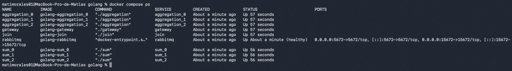
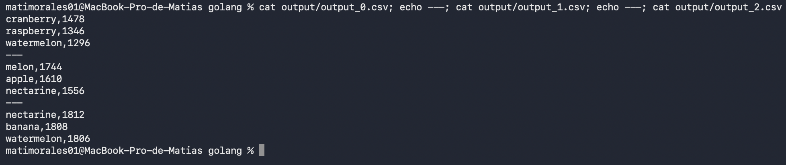
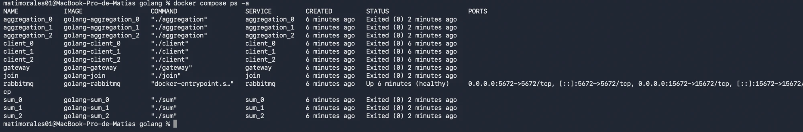

# Informe

Elegí Golang. La carpeta `python` quedó sin tocar.

Cuando digo "réplica" me refiero a cada instancia corriendo en paralelo del mismo control: `sum_0`, `sum_1` y `sum_2` son 3 réplicas de Sum, corriendo el mismo código cada una.

## Middleware

Implementé la interfaz `Middleware` con la librería `amqp091-go`. Hay dos tipos:

- **Cola**: la cola es durable y los mensajes se mandan como persistentes, así si RabbitMQ se reinicia no se pierden los que todavía no se consumieron. Funciona como working queue. Si varias réplicas la escuchan, RabbitMQ les reparte los mensajes de a uno, round robin, así que el balanceo entre réplicas no lo tengo que programar yo.
- **Exchange**: es de tipo `direct`. El `Send` del middleware publica el mensaje una vez por cada routing key con la que se creó el exchange. Si se crea con las keys de todas las réplicas, el mensaje les llega a todas (queda como un broadcast), y si se crea con una sola key, le llega solo a esa. Para escuchar, se crea una cola propia y se la conecta a esas mismas keys. Lo uso para repartir los datos de Sum hacia Aggregation: cada réplica de Sum arma un exchange por cada partición de Aggregation, con una sola key, para mandarle solo lo que le corresponde a esa partición.

El envío de mensajes (`Send`) está protegido con un mutex, porque el Gateway (que no se puede modificar) atiende a cada cliente en su propia goroutine, y todas usan el mismo middleware para mandar datos a la cola de entrada. Un channel de AMQP no se puede usar para publicar desde varias goroutines a la vez, así que sin ese lock, apenas hay más de un cliente conectado, los mensajes se corrompen o se mezclan.

## Aislamiento por cliente (escala respecto a los clientes)

Con varios clientes mandando datos al mismo tiempo, hace falta saber de cuál viene cada dato, si no sus números se mezclan en el mismo lugar. Por eso cada mensaje del protocolo interno (`common/messageprotocol/inner`) lleva un campo `client_id`, y también un campo `eof` que marca si ese mensaje es el último de ese cliente.

El id se genera una sola vez, cuando el cliente se conecta, en `message_handler.go` (es el único archivo del gateway que no se pisa al corregir el TP). Desde ahí, ese mismo id viaja en todos los mensajes de ese cliente.

Con esto, Sum, Aggregation y Join tienen un mapa de fruta y cantidad por cada cliente, en vez de uno solo compartido. Y el gateway usa ese mismo id para saber, entre todos los clientes que tiene conectados en ese momento, a cuál le corresponde cada resultado que le llega.

## Coordinación entre réplicas de Sum

Las réplicas de Sum compiten por consumir de la misma cola de entrada. Por ser una working queue, el mensaje de fin que manda el gateway cuando un cliente termina lo agarra una sola réplica. Las demás se quedan con datos de ese cliente ya acumulados, sin enterarse de que hay que mandarlos.

Para resolver esto, la réplica que recibe el aviso de fin manda su propia parte de los datos hacia Aggregation, y después vuelve a publicar ese mismo aviso **en la misma cola de entrada**, con un contador que arranca en `SUM_AMOUNT` y baja de a uno. Como viaja por la misma cola, al mismo consumidor, en el mismo orden que los datos, cualquier réplica que lo reciba ya terminó de procesar todo lo suyo para ese cliente antes de verlo — no puede haber ninguna carrera entre datos y aviso, porque son literalmente el mismo canal.

Cada réplica marca localmente si ya mandó sus datos para ese cliente. Si el aviso vuelve a pasarle a una réplica que ya hizo su parte, no hace nada más que reenviarlo tal cual. Deja de circular cuando el contador llega a 0, o sea cuando ya mandaron su parte las `SUM_AMOUNT` réplicas.

Antes de llegar a este diseño probé coordinar las réplicas con un exchange aparte, donde la que veía el aviso de fin les avisaba a las demás por un canal de control separado. Funcionaba casi siempre, pero corriendo el verificador muchas veces seguidas encontré que a veces (más o menos 1 de cada 7) se perdían datos: una réplica podía recibir el aviso de control justo cuando todavía tenía un mensaje de datos de ese cliente en camino por la cola normal, sin procesar. Como eran dos conexiones separadas a RabbitMQ, no hay forma de garantizar en qué orden llegan. Cambié al diseño actual porque no depende de ningún orden entre conexiones distintas, usa una sola.

Del lado de Aggregation hay una barrera: como le pueden llegar varios avisos de fin de un mismo cliente (uno por cada réplica de Sum), cuenta cuántos recibió y espera a tener uno por cada réplica (`SUM_AMOUNT`) antes de calcular el top parcial.

## Particionado hacia Aggregation y merge en Join

Cada fruta se manda a una sola réplica de Aggregation, elegida con un hash sobre el nombre de la fruta (`hash/fnv`, de la librería estándar de Go, alcanza porque acá no hace falta nada criptográfico). Así se evita que todas las réplicas de Aggregation terminen calculando exactamente lo mismo, que sería trabajo y tráfico de más.

Cada réplica de Sum manda un mensaje por cada partición de Aggregation que exista, aunque esa partición quede vacía para esa réplica en particular. Así Aggregation siempre sabe que esa réplica de Sum ya terminó, tenga datos para mandarle o no.

Hay algo a tener en cuenta acá. Si las frutas están repartidas entre varias réplicas de Aggregation, cada una ve solo una parte del total, entonces el top 3 que calcula cada una por separado no es el top 3 real, porque puede haber una fruta con más cantidad en otra partición que esa réplica no vio.

Por eso Join tiene la misma barrera que Aggregation, pero contando avisos por `AGGREGATION_AMOUNT`. Junta los tops parciales de todas las réplicas de Aggregation de un mismo cliente, y recién cuando tiene uno de cada una calcula el top final.

Funciona porque si una fruta está en el top 3 real, también tiene que estar en el top de su propia partición (ahí compite con menos frutas, nunca con más). Entonces el top final siempre se puede armar juntando los tops parciales.

La cantidad de réplicas de Sum y de Aggregation se define con las variables de entorno `SUM_AMOUNT` y `AGGREGATION_AMOUNT`, sin tocar código. Eso es lo que permite escalar la cantidad de controles.

Con respecto al volumen de datos, ningún control guarda las filas que le llegan, solo va acumulando la cantidad por fruta. Entonces la memoria que usa depende de cuántas frutas distintas hay y no de cuán grande sea el archivo de entrada. Además, como no se manda todo a todos, cada réplica de Aggregation procesa y guarda solo su propia parte. Y cuando termina un cliente, Sum, Aggregation y Join borran todo lo que tenían guardado de ese cliente, así el estado no va creciendo con los clientes que ya se atendieron.

### Ejemplo

Con el escenario 4 activo (3 réplicas de Sum, 3 de Aggregation, 3 clientes):

```bash
make switch   # opción 4
make up
docker compose ps
```



Y los 3 clientes reciben su top correcto, verificado contra la suma manual de cada dataset de entrada:



## Cierre prolijo (SIGTERM)

Sum, Aggregation y Join manejan la señal SIGTERM con un goroutine aparte que la espera y, al recibirla, llama a `StopConsuming()` para que el programa termine solo, en vez de quedarse esperando hasta que Docker lo mate a la fuerza con SIGKILL. Una vez que `StartConsuming` corta (porque se dejó de consumir), cada uno cierra explícitamente sus conexiones a RabbitMQ antes de terminar.

También encontré un bug en el middleware: `StopConsuming` cancelaba el consumidor pasándole un tag vacío en vez del tag real generado al arrancar a consumir, entonces en la práctica no cancelaba nada. Lo arreglé guardando el tag real cuando arranca el consumo, para poder cancelarlo bien después.

### Ejemplo

```bash
docker stop -t 5 sum_0 sum_1 sum_2 aggregation_0 aggregation_1 aggregation_2 join gateway
docker compose ps -a
```



Todos terminan con código 0, sin llegar al timeout de 5 segundos que hubiera forzado un SIGKILL (que se vería como código 137).
